Python 3.6.3

Anaconda 5.0.1

Pycharm

Pycharm 与 anaconda的安装参考博文：

<https://blog.csdn.net/yggaoeecs/article/details/78378938>

理论：可以参考：<https://wenku.baidu.com/view/aac3efef4afe04a1b071de97.html>

**集中趋势：均值、分位数（四分位数）、中位数、众数**

| 分位数最常用的是四分位数，四分位数（*Quartile*），即*统计学*中，把所有数值由小到大排列并分成四等份，处于三个分割点位置的得分就是四分位数。 第一四分位数 (Q1)，又称“较小四分位数”，等于该样本中所有数值由小到大排列后第25%的*数字*。 第二四分位数 (Q2)，又称“*中位数*”，等于该样本中所有数值由小到大排列后第50%的数字。 第三四分位数 (Q3)，又称“较大四分位数”，等于该样本中所有数值由小到大排列后第75%的数字。 第三四分位数与第一四分位数的差距又称*四分位距*（InterQuartile Range,IQR）。 首先确定四分位数的位置： **Q1的位置= (n+1) × 0.25 Q2的位置= (n+1) × 0.5 Q3的位置= (n+1) × 0.75** n表示项数 对于四分位数的确定，有不同的方法，另外一种方法基于N-1 基础。即 Q1的位置=（n-1）x 0.25 Q2的位置=（n-1）x 0.5 Q3的位置=（n-1）x 0.75 Excel 中有两个四分位数的函数。QUARTILE.EXC 和QUARTILE.INC QUATILE.EXC 基于 N+1 的方法，QUARTILE.INC基于N-1的方法。 |
|------------------------------------------------------------------------------------------------------------------------------------------------------------------------------------------------------------------------------------------------------------------------------------------------------------------------------------------------------------------------------------------------------------------------------------------------------------------------------------------------------------------------------------------------------------------------------------------------------------------------------------------------------------------------------------------------------------------------------------------------------------------------------------------------------------------------------------------------------------|
| 众数（Mode）统计学名词，将数据按从大到小顺序排列后，在统计分布上具有明显集中趋势点的数值，代表数据的一般水平（众数可以不存在或多于一个）。 当数值或被观察者没有明显次序（常发生于非数值性资料）时特别有用，由于可能无法良好定义算术平均数和中位数。例子：{苹果, 苹果, 香蕉, 橙, 橙, 橙, 桃}的众数是橙。在高斯分布中，众数位于峰值。                                                                                                                                                                                                                                                                                                                                                                                                                                                                                                                        |

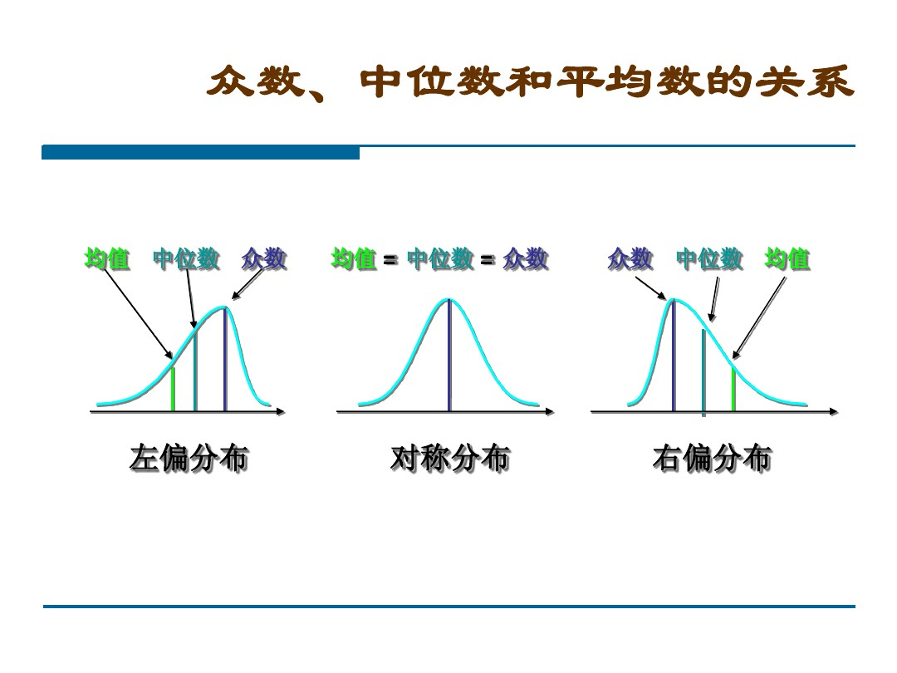

离中趋势：标准差、方差

数据分布：偏态与峰态、正态分布与三大分布

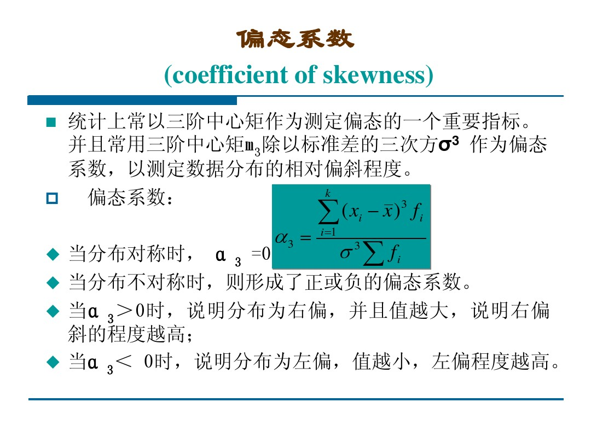

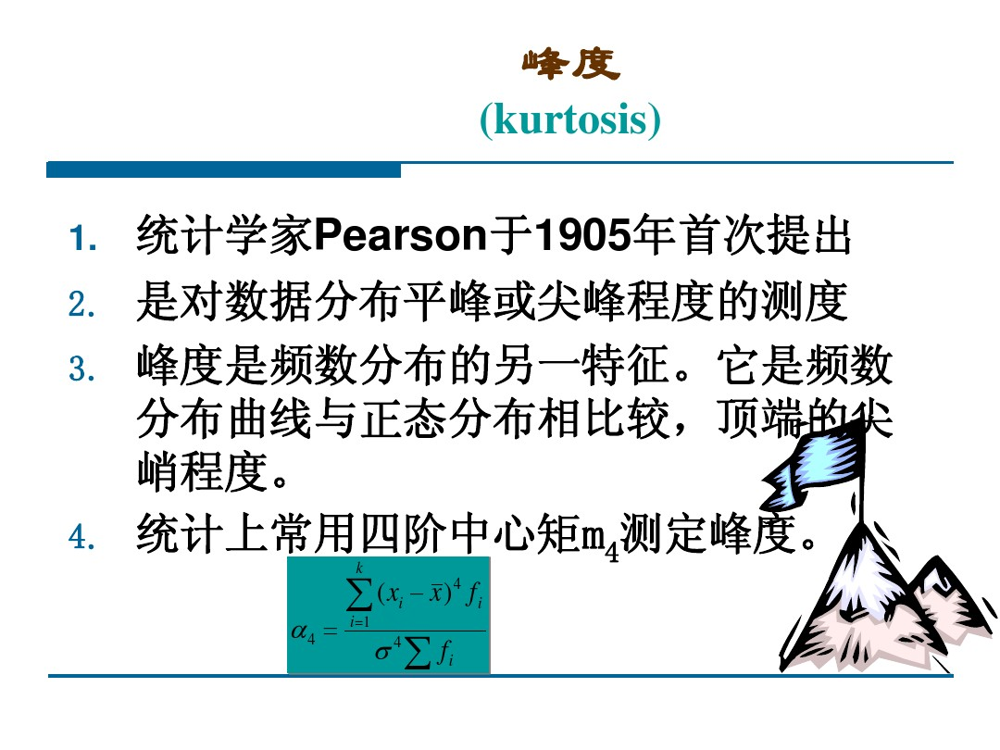

抽样理论：抽样误差、抽样精度

完全随机抽样、等差距的抽样、分类分层抽样（根据各个类别的比例抽样，保证样本在某类别的分布与总体是一致的）

重复抽样和不重复抽样的误差不一样

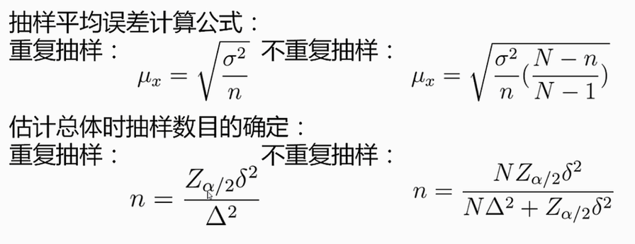

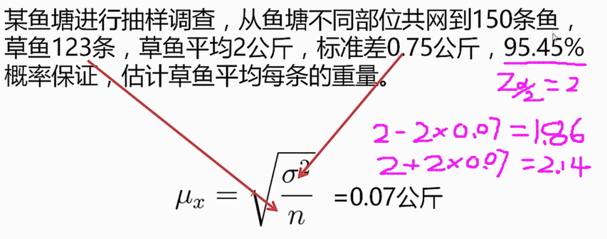

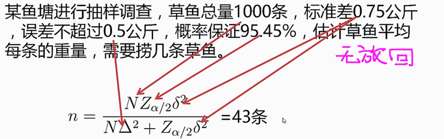

数据分析：

import pandas as pd

data=pd.read_csv(filename)

data.mean()\#均值

data.median()\#中位数

data.quantile(q=0.25)\#四分位数

data.mode()\#众数，对于众数来说有可能不是唯一的，众数可能返回有多行

data.std()\#标准差

data.var()\#方差

data.sum()\#离散数据求和会拼接起来

data.skew()\#偏态系数，负值表示平均值偏小，大部分数据大于平均值

data.kurt()\#峰度系数，以正态分布为0作为标准。负值表示比正太平缓

import scipy.stats as ss

\#生成正态分布

ss.norm

\#查看特征

ss.norm.stats(moments ='mvsk')

\#制定横坐标返回纵坐标的值

ss.norm.pdf(0.0)

\#累计到0-1之间的某个数，对应的横坐标的值

ss.norm.ppf(0.8)

\#累计概率

ss.norm.cdf(2)

ss.norm.cdf(2)-ss.norm.cdf(-2)

0.9544997361036416

\#得到n个符合正太分布的数字

ss.norm.rvs(size=10)

array([ 0.42708043, -1.1552152 , 0.31892356, 0.25194965, 0.40497454,-2.14478749,
0.83372293, 0.71530381,0.25624798, -0.56659251])

\#卡方分布

ss.chi2

\#t分布

ss.t

\#f分布

ss.f

\#抽样

data.sample(n=10)

data.sample(frac = 0.001)

'''

**异常值分析：**

离散异常值，连续异常值，常识异常值

对比分析：

绝对数与相对数，时间空间理论维度比较

结构分析：

各组成部分的分布与规律

分布分析：

数据分布频率的显式分析

'''

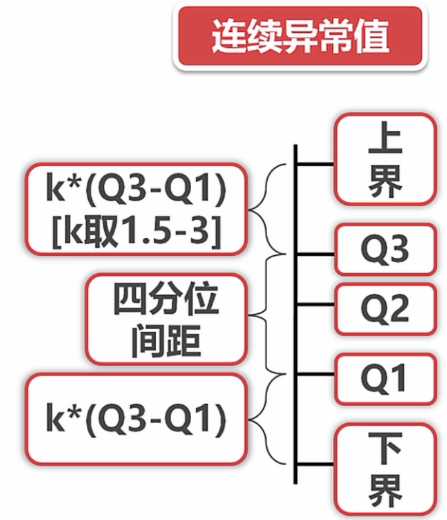

直接舍弃

取边界值代替

直接舍弃

当作单独值处理

同比（今年六月份，去年六月份），环比（五月份、六月份）

Numpy,切分数据：

np.histogram(sl_s.values,bins=np.arange(0,1,0.1))

(array([ 195, 1214, 532, 974, 1668, 2146, 1973, 2074, 2440], dtype=int64),
array([0. , 0.1, 0.2, 0.3, 0.4, 0.5, 0.6, 0.7, 0.8, 0.9]))\#数据负偏

np_s.value_counts()\#统计序列离散值出现的次数

np_s.value_counts(normalize=True) \#统计序列离散值出现的频率（百分数）

np.histogram(amh_s.values,bins=np.arange(amh_s.min(),amh_s.max()+10,10))

(array([ 168, 171, 147, 807, 1153, 1234, 1075, 824, 818, 758, 751,

738, 856, 824, 987, 1002, 1045, 935, 299, 193, 131, 86],

dtype=int64), array([ 96, 106, 116, 126, 136, 146, 156, 166, 176, 186, 196, 206,
216,

226, 236, 246, 256, 266, 276, 286, 296, 306, 316], dtype=int64))

amh_s.value_counts(bins=np.arange(amh_s.min(),amh_s.max()+10,10))

(146.0, 156.0] 1277

(136.0, 146.0] 1159

(256.0, 266.0] 1063

value_counts的方式获得的区间是左开右闭的取件，histogram是左闭右开的区间。

**\>\>\>**s_s.where(s_s!='nme').dropna()\#去除值为某项特定值的数据。

异常值处理：

\#1、空值

**\>\>\>**df = df.dropna(axis=0,how='any')

axis表示去除异常值所在的行还是列。0代表删除所在的行，1代表删除所在的列。

how表示判断依据。’all’表示行或列均为异常值时才删除，’any’表示只要有异常值就删除行或者列。

\#2、根据数据取值范围清理（之前应该分属性考察异常值情况）

mean(),std(),median(),skew(),kurt()

**\>\>\>**df
=df[df['last_evaluation']\<1][df['salary']!='nme'][df['department']!='sale']

\#切片对比分析：

**\>\>\>**df.loc[:,['department','satisfaction_level']].groupby('department').mean()

satisfaction_level

**\>\>\>**department

IT 0.617586

RandD 0.620286

accounting 0.579380

hr 0.595138

management 0.619791

marketing 0.616335

product_mng 0.618225

sales 0.611716

support 0.616158

technical 0.603390

自定义对比分析：

**\>\>\>**df.loc[:,['average_monthly_hours',"department"]].groupby("department")['average_monthly_hours'].apply(lambda
x:x.max()-x.min())

**\>\>\>**department

IT 212

RandD 210

accounting 213

hr 212

management 210

marketing 214

product_mng 212

sales 214

support 214

technical 213

Name: average_monthly_hours, dtype: int64

可视化分析：

Python可视化工具：matplotlib、seaborn、plotly（画出的表格可以直接用在网页中）

柱状图：matplotlib

plt.title('SALARY')  
plt.xlabel('salary')  
plt.ylabel('Number')  
plt.xticks(np.arange(len(df['salary'].value_counts())),df['salary'].value_counts().index)  
plt.bar(np.arange(len(df['salary'].value_counts())),df['salary'].value_counts())  
*for* x,y *in*
zip(np.arange(len(df['salary'].value_counts())),df['salary'].value_counts()):  
plt.text(x,y,y,ha='center',va='bottom')  
plt.show()

\<class 'zip'\>zip函数：

以下实例展示了 zip 的使用方法：

\>\>\>a = [1,2,3]

\>\>\> b = [4,5,6]

\>\>\> c = [4,5,6,7,8]

\>\>\> zipped = zip(a,b) \# 打包为元组的列表

[(1, 4), (2, 5), (3, 6)]

\>\>\> zip(a,c) \# 元素个数与最短的列表一致

[(1, 4), (2, 5), (3, 6)]

\#text函数：plt.text(x,y,y,ha='center',va='bottom')

plt.text():
在任意位置增加文本。（x,y:坐标，y：文本，ha：水平位置，va：垂直位置）

\#bar函数：plt.bar(left, height, width, bottom) : 绘制条形图

plt.xticks \#绘制横坐标标签

seaborn：

改变样式

sns.set_style("darkgrid")  
sns.set_context("talk")

sns.set_palette(sns.color_palette('RdBu',n_colors=7))

\#直接画图（自动汇总）

sns.countplot(x='salary',data=df)

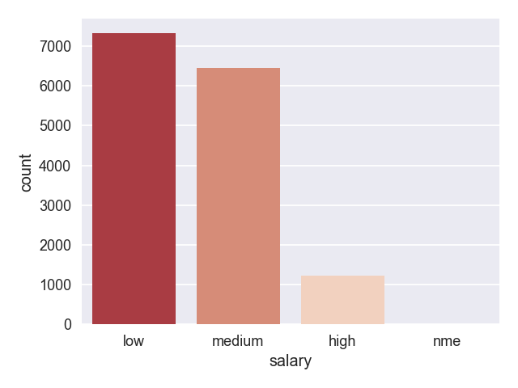

\#多层画图

sns.countplot(x='salary',hue="department",data=df)

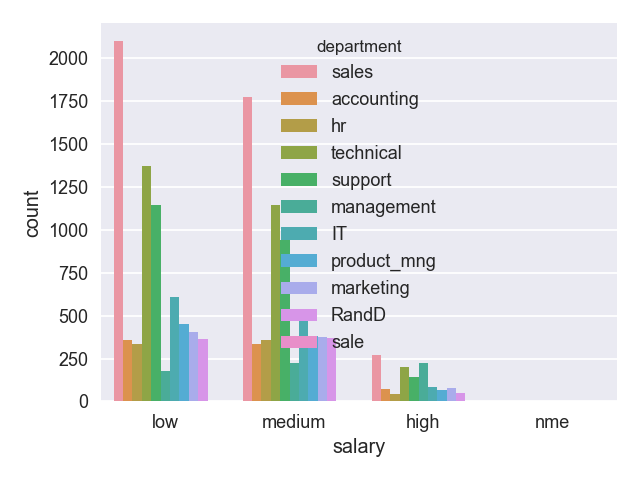

直方图：

f = plt.figure()\#建立画布  
f.add_subplot(1,3,1)\#加子图  
sns.distplot(df['satisfaction_level'],bins=10)

f.add_subplot(1,3,2)  
sns.distplot(df['satisfaction_level'],bins=10,kde=*False*)

f.add_subplot(1,3,3)  
sns.distplot(df['satisfaction_level'],bins=10,hist=*False*)

据负片y,

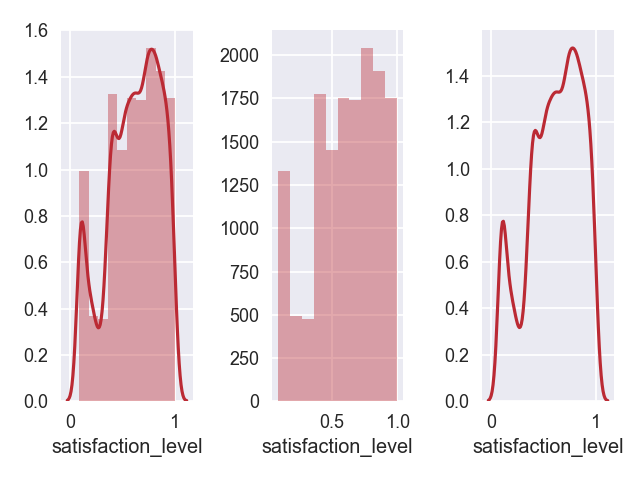

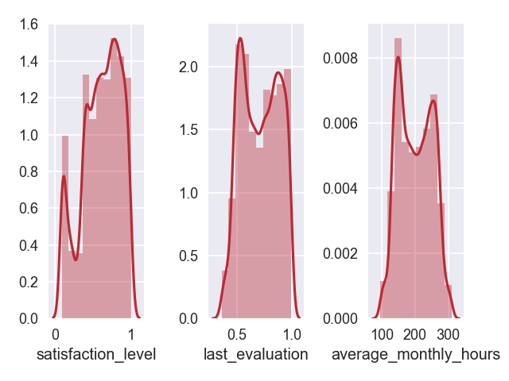

箱线图发现异常值：

sns.boxplot(y=df['time_spend_company'],saturation=0.75,whis=1.5)

saturation：分位数

whis：上届与下届的界定数

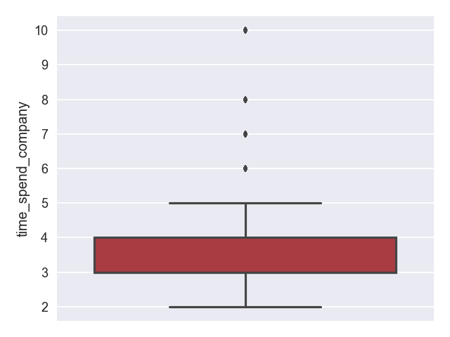

折线图：

sub_df = df.groupby('time_spend_company').mean()  
sns.pointplot(sub_df.index,sub_df['left'])

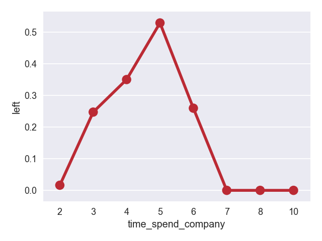

sns.pointplot(x='time_spend_company',y='left',data=df)

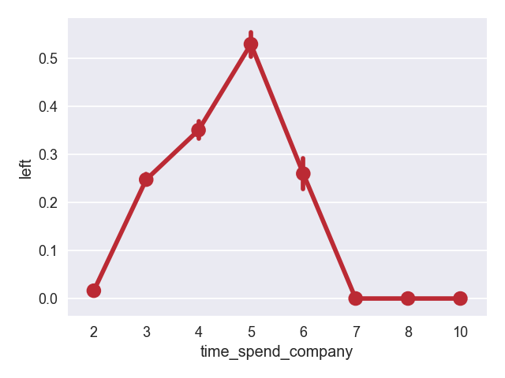

饼图：

\#pie  
lbs = df['salary'].value_counts().index  
exps = [0.1 *if* i == 'low' *else* 0 *for* i *in* lbs]  
plt.pie(df['salary'].value_counts(normalize=*True*),labels=lbs,explode=exps,autopct='%1.1f%%')

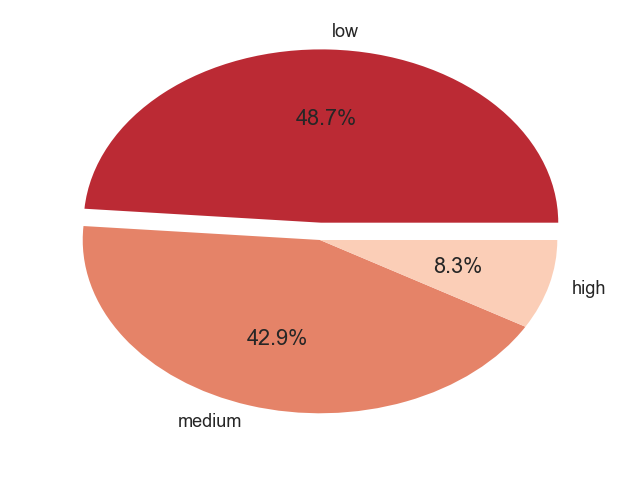
