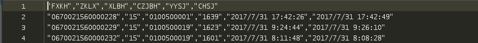
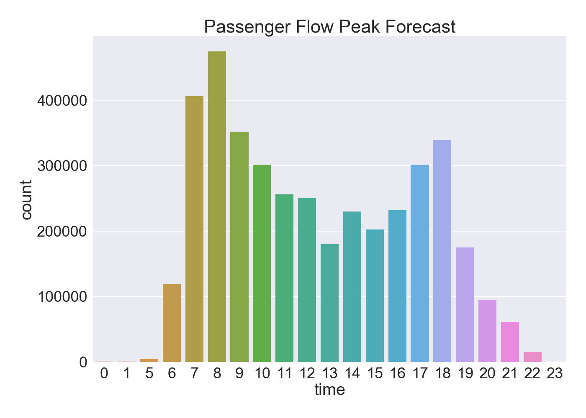
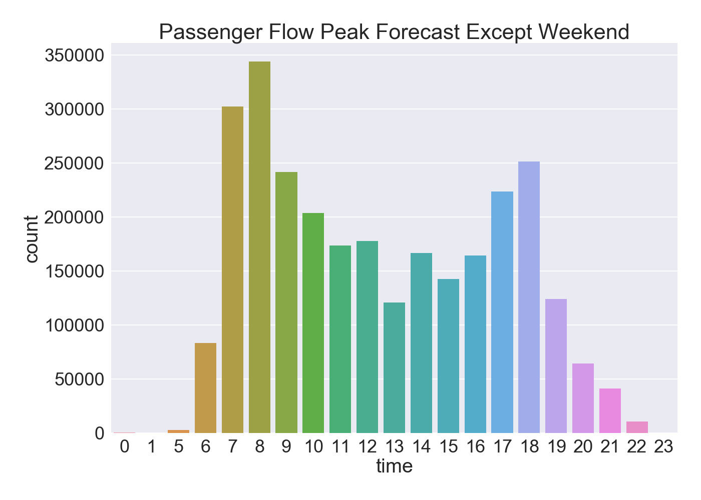
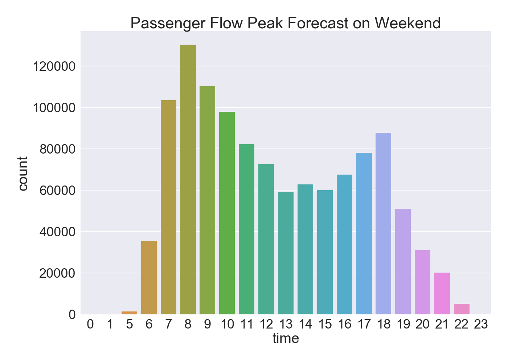
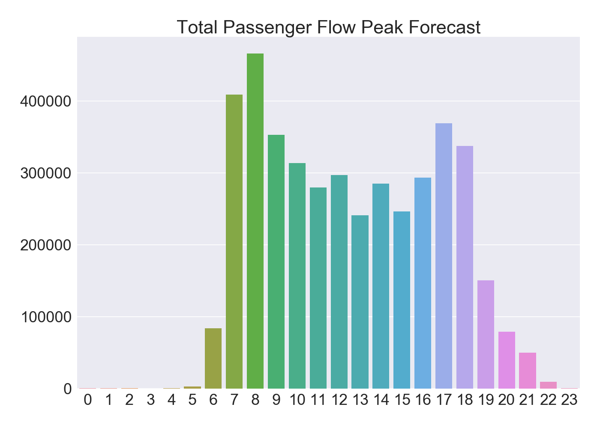
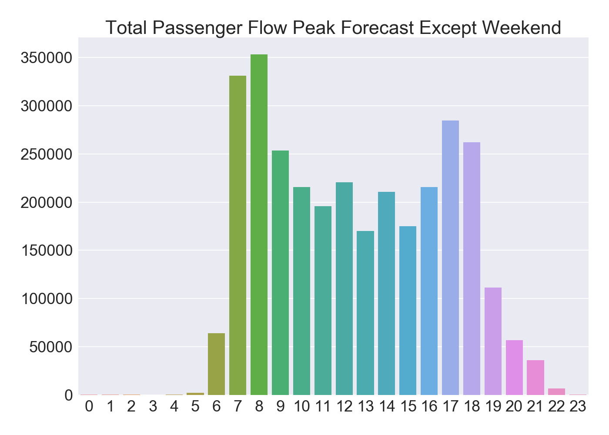
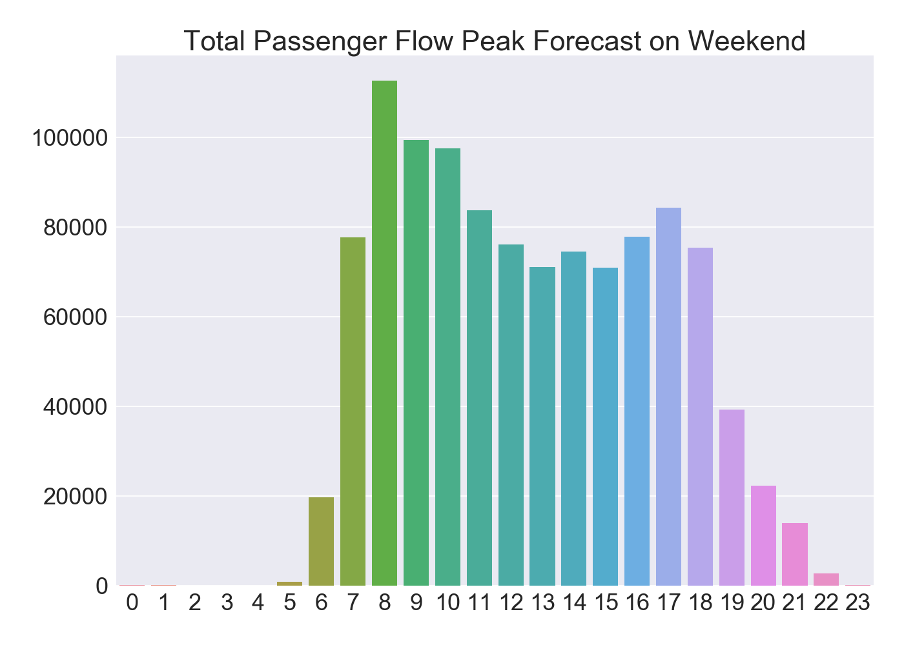
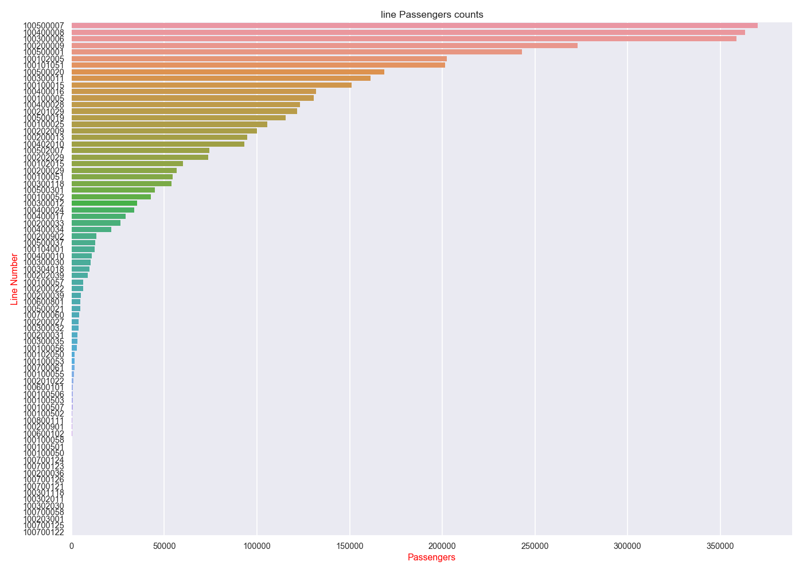
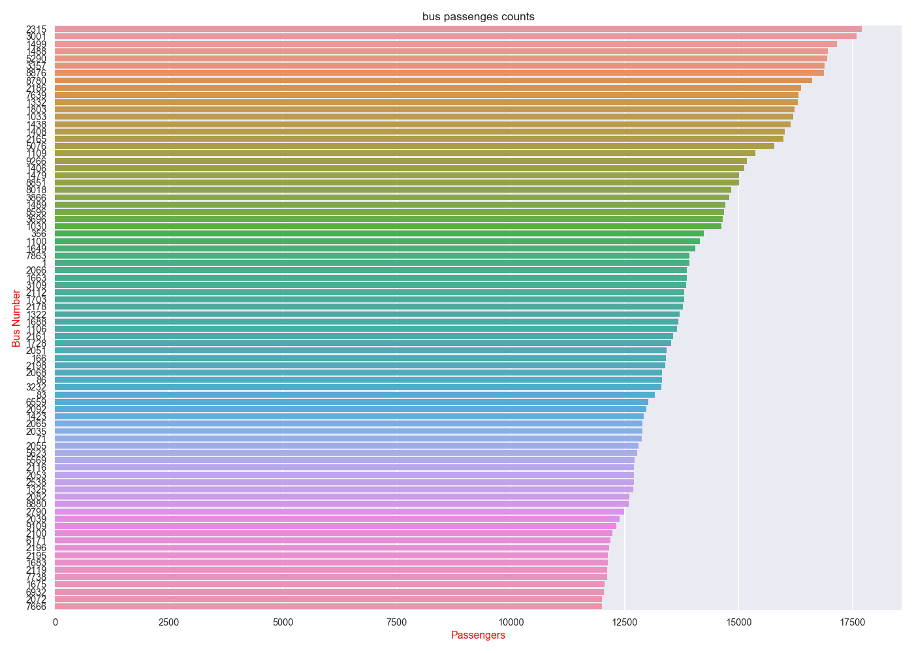

客流高峰预测
============

根据公交卡刷卡数据预测客流高峰

数据是最近一年的刷卡数据

数据格式如下：

单个数据分析的客流高峰，分周末和非周末

代码：

\#FXKH（卡号）,ZKLX（路线）,XLBH（线路编号）,CZJBH（车辆）,YYSJ（刷卡时间）,CHSJ（传回时间）  
*import* pandas *as* pd  
*import* numpy *as* np  
*import* seaborn *as* sns  
*import* matplotlib.pyplot *as* plt  
  
\#读取数据  
data = pd.read_csv('./data/201707.csv')  
\#整体的高峰预测  
\#时间格式转换object to datetime64[ns]  
data['YYSJ']=pd.to_datetime(data['YYSJ'])  
\#分割日期和时间  
data['time'] = data['YYSJ'].dt.time  
\#按时间段统计,分成24个时间段，若分钟数大于30，则小时按照小时+1统计。  
data['time'] = data['time'].apply(*lambda* x:x.hour+1 *if* x.hour\<23 *and*
x.minute \>= 30 *else* 0 *if* x.hour==24 *else* x.hour)  
  
\#绘图  
sns.set(context="talk",font_scale=2, style='darkgrid')  
f, ax= plt.subplots(figsize = (14, 10))  
ax.set_title('Passenger Flow Peak Forecast')  
sns.countplot(x=data['time'])  
plt.show()  
f.savefig('P_F_P_F.png', dpi=100, bbox_inches='tight')  
  
\#判断否周末  
data['weekday_name']=pd.to_datetime(data['YYSJ']).dt.weekday_name  
no_weekend_time =
data[data['weekday_name']!='Saturday'][data['weekday_name']!='Sunday']['time']  
\#非周末高峰预测  
f, ax= plt.subplots(figsize = (14, 10))  
ax.set_title('Passenger Flow Peak Forecast Except Weekend')  
sns.countplot(x=no_weekend_time)  
plt.show()  
f.savefig('P_F_P_F_E_W.png', dpi=100, bbox_inches='tight')  
\#周末高峰预测  
\#判断是周末  
is_weekend_time = data.loc[\~((data.weekday_name !=
'Saturday')&(data.weekday_name != 'Sunday')),'time']  
\#非周末高峰预测  
f, ax= plt.subplots(figsize = (14, 10))  
ax.set_title('Passenger Flow Peak Forecast on Weekend')  
sns.countplot(x=is_weekend_time)  
plt.show()  
f.savefig('P_F_P_F_W.png', dpi=100, bbox_inches='tight')

整体数据分析客流高峰，分周末和非周末

代码：

\#FXKH（卡号）,ZKLX（路线）,XLBH（线路编号）,CZJBH（车辆）,YYSJ（刷卡时间）,CHSJ（传回时间）  
*import* pandas *as* pd  
*import* seaborn *as* sns  
*import* matplotlib.pyplot *as* plt  
*import* math  
  
file_name_list=['201708.csv','201709.csv','201710.csv','201711.csv','201712.csv','201801.csv','201802.csv','201803.csv','201804.csv','201805.csv','201806.csv']  
  
data = pd.read_csv('./data/201707.csv')  
\#整体的高峰预测  
\#时间格式转换object to datetime64[ns]  
data['YYSJ']=pd.to_datetime(data['YYSJ'])  
\#分割日期和时间  
data['time'] = data['YYSJ'].dt.time  
\#按时间段统计,分成24个时间段，若分钟数大于30，则小时按照小时+1统计。  
data['time'] = data['time'].apply(*lambda* x:x.hour+1 *if* x.hour\<23 *and*
x.minute \>= 30 *else* 0 *if* x.hour==24 *else* x.hour)  
time_counts = data['time'].value_counts()  
\#判断非周末  
data['weekday_name']=pd.to_datetime(data['YYSJ']).dt.weekday_name  
no_weekend_time =
data[data['weekday_name']!='Saturday'][data['weekday_name']!='Sunday']['time']  
no_weekend_counts=no_weekend_time.value_counts()  
\#判断是周末  
is_weekend_time = data.loc[\~((data.weekday_name !=
'Saturday')&(data.weekday_name != 'Sunday')),'time']  
is_weekend_counts = is_weekend_time.value_counts()  
  
  
*for* file *in* file_name_list:  
data = pd.read_csv('./data/'+file)  
\# 整体的高峰预测  
\# 时间格式转换object to datetime64[ns]  
data['YYSJ'] = pd.to_datetime(data['YYSJ'])  
\# 分割日期和时间  
data['time'] = data['YYSJ'].dt.time  
\# 按时间段统计,分成24个时间段，若分钟数大于30，则小时按照小时+1统计。  
data['time'] = data['time'].apply(*lambda* x: x.hour + 1 *if* x.hour \< 23 *and*
x.minute \>= 30 *else* 0 *if* x.hour == 24 *else* x.hour)  
time_counts = time_counts.add(data['time'].value_counts())  
time_counts = time_counts.apply(*lambda* x:0 *if* math.isnan(x) *else* x)  
  
\# 判断非周末  
data['weekday_name'] = pd.to_datetime(data['YYSJ']).dt.weekday_name  
no_weekend_time = data[data['weekday_name'] != 'Saturday'][data['weekday_name']
!= 'Sunday']['time']  
no_weekend_counts =no_weekend_counts.add(no_weekend_time.value_counts())  
no_weekend_counts = no_weekend_counts.apply(*lambda* x:0 *if* math.isnan(x)
*else* x)  
\# 判断是周末  
is_weekend_time = data.loc[\~((data.weekday_name != 'Saturday') &
(data.weekday_name != 'Sunday')), 'time']  
is_weekend_counts = is_weekend_counts.add(is_weekend_time.value_counts())  
is_weekend_counts = is_weekend_counts.apply(*lambda* x: 0 *if* math.isnan(x)
*else* x)  
  
time_counts = time_counts/(len(file_name_list)+1)  
no_weekend_counts=no_weekend_counts/(len(file_name_list)+1)  
is_weekend_counts=is_weekend_counts/(len(file_name_list)+1)  
  
\#绘图  
sns.set(context="talk",font_scale=2, style='darkgrid')  
f, ax= plt.subplots(figsize = (14, 10))  
ax.set_title('Total Passenger Flow Peak Forecast')  
sns.barplot(x=time_counts.index,y=time_counts.values)  
plt.show()  
f.savefig('T_P_F_P_F.png', dpi=100, bbox_inches='tight')  
  
  
\#非周末高峰预测  
f, ax= plt.subplots(figsize = (14, 10))  
ax.set_title('Total Passenger Flow Peak Forecast Except Weekend')  
sns.barplot(x=no_weekend_counts.index,y=no_weekend_counts.values)  
plt.show()  
f.savefig('T_P_F_P_F_E_W.png', dpi=100, bbox_inches='tight')  
\#周末高峰预测  
\#判断是否周末  
is_weekend_time = data.loc[\~((data.weekday_name !=
'Saturday')&(data.weekday_name != 'Sunday')),'time']  
\#非周末高峰预测  
f, ax= plt.subplots(figsize = (14, 10))  
ax.set_title('Total Passenger Flow Peak Forecast on Weekend')  
sns.barplot(x=is_weekend_counts.index,y=is_weekend_counts.values)  
plt.show()  
f.savefig('T_P_F_P_F_W.png', dpi=100, bbox_inches='tight')

整体数据分析线路和bus载客量

代码：

\#FXKH（卡号）,ZKLX（路线）,XLBH（线路编号）,CZJBH（车辆）,YYSJ（刷卡时间）,CHSJ（传回时间）  
*import* pandas *as* pd  
*from* pandas *import* DataFrame  
*import* seaborn *as* sns  
*import* matplotlib.pyplot *as* plt  
*import* math  
  
file_name_list=['201708.csv','201709.csv','201710.csv','201711.csv','201712.csv','201801.csv','201802.csv','201803.csv','201804.csv','201805.csv','201806.csv']  
  
data = pd.read_csv('./data/201707.csv')  
line_passenges_counts = data['XLBH'].value_counts()  
bus_passenges_counts = data['CZJBH'].value_counts()  
line_passenges_mothly_counts = data['XLBH'].value_counts()  
bus_passenges_mothly_counts = data['CZJBH'].value_counts()  
*for* file *in* file_name_list:  
data = pd.read_csv('./data/'+file)  
line_passenges_counts = line_passenges_counts.add(data['XLBH'].value_counts())  
line_passenges_counts = line_passenges_counts.apply(*lambda* x:0 *if*
math.isnan(x) *else* x)  
bus_passenges_counts = bus_passenges_counts.add(data['CZJBH'].value_counts())  
bus_passenges_counts = bus_passenges_counts.apply(*lambda* x: 0 *if*
math.isnan(x) *else* x)  
line_passenges_mothly_counts =
pd.concat([line_passenges_mothly_counts,data['XLBH'].value_counts()],axis=1)  
bus_passenges_mothly_counts=pd.concat([bus_passenges_mothly_counts,data['CZJBH'].value_counts()],axis=1)  
line_passenges_counts = line_passenges_counts/(len(file_name_list)+1)  
bus_passenges_counts = bus_passenges_counts/(len(file_name_list)+1)  
line_passenges_mothly_counts=line_passenges_mothly_counts.fillna(0)  
bus_passenges_mothly_counts=bus_passenges_mothly_counts.fillna(0)  
\#重新命名属性  
line_passenges_mothly_counts.columns=['201707','201708','201709','201710','201711','201712','201801','201802','201803','201804','201805','201806']  
bus_passenges_mothly_counts.columns=['201707','201708','201709','201710','201711','201712','201801','201802','201803','201804','201805','201806']  
\#存储线路和车在不同月份的载客量  
line_passenges_mothly_counts.to_csv('line_passenges_mothly_counts.csv')  
bus_passenges_mothly_counts.to_csv('bus_passenges_mothly_counts.csv')  
\#绘图  
\#seaborn如何解决无序柱状图的问题？  
line_passenges_counts=line_passenges_counts.sort_values(ascending=*False*)  
x=line_passenges_counts.values  
y=line_passenges_counts.index  
plot_df=DataFrame({'values':x,'ind':y})  
sns.set(context="talk",font_scale=0.8, style='darkgrid')  
f, ax= plt.subplots(figsize = (14, 10))  
ax.set_title('line Passengers counts')  
sns.barplot(plot_df['values'],plot_df['ind'],orient='h',order=plot_df['ind'])  
ax.set_ylabel("Line Number",color='r')  
ax.set_xlabel('Passengers',color='r')  
plt.show()  
f.savefig('line_passengers_counts.png', dpi=100, bbox_inches='tight')  
  
f, ax= plt.subplots(figsize = (14, 10))  
ax.set_title('bus passenges counts')  
plot_df=DataFrame({'values':bus_passenges_counts.sort_values(ascending=*False*).head(80).values,'ind':bus_passenges_counts.sort_values(ascending=*False*).head(80).index})  
sns.barplot(plot_df['values'],plot_df['ind'],orient='h',order=plot_df['ind'])  
ax.set_ylabel("Bus Number",color='r')  
ax.set_xlabel('Passengers',color='r')  
plt.show()  
f.savefig('bus_passengers_counts.png', dpi=100, bbox_inches='tight')

如何解决seaborn 在画barplot的时候柱状图无序显示：

Series是有序的（value_counts），尽管使用order参数，柱状图依旧是无序显示。将Series排序之后的index和value包装成DataFrame，利用DataFrame画bar，也使用order参数，柱状图实现有序展示。具体见代码。
